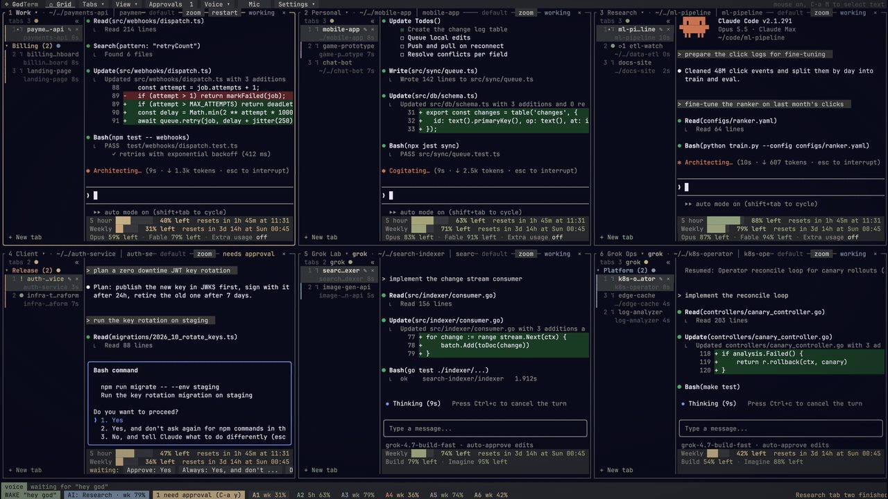
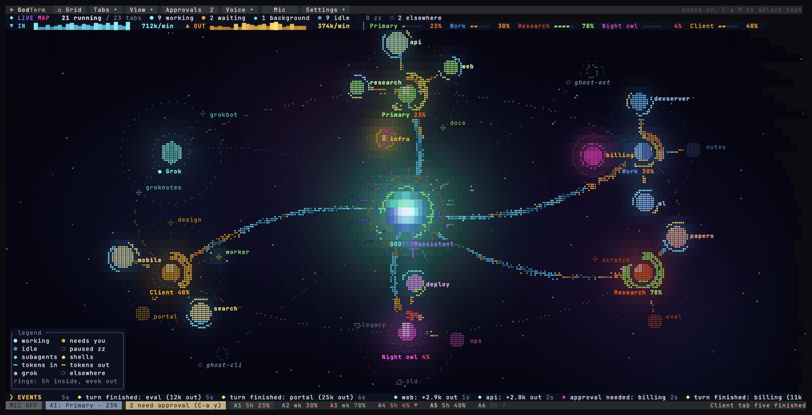

<p align="center">
  
</p>

<h1 align="center">GodTerm</h1>

<p align="center">
  <b>Run many Claude Code and Grok sessions side by side, each on its own account, and drive them by voice.</b>
</p>

<p align="center">
  <a href="https://github.com/daniel-farina/godterm/releases/latest"></a>
  <a href="LICENSE"></a>
  <a href="https://github.com/daniel-farina/godterm/actions/workflows/ci.yml"></a>
  <a href="https://godterm.com">godterm.com</a>
</p>

<p align="center">
  <a href="https://godterm.com/#demo"></a>
  <br>
  <sub><a href="https://godterm.com/#demo">Watch the 2 minute demo</a> · <a href="https://github.com/daniel-farina/godterm/releases/download/v0.2.0/godterm-demo.mp4">or download the MP4 (1080p)</a></sub>
</p>

GodTerm is a terminal app for people who run Claude Code (and Grok Build)
all day. Every pane is a real, interactive `claude` (or `grok`) session,
each signed in to a different account, so one subscription's limits never
stop the others. Usage for every account sits under its pane, past
sessions are a click away, and a voice assistant can open tabs, send
prompts, answer approvals and move a conversation to another account while
your hands stay on the keyboard (or off it).

Interactive slots also support **Codex CLI, Cursor CLI, Antigravity CLI
(`agy`) and OpenCode**. Choose one in Add account, or set an account's
`harness` in config.toml. These integrations support terminal input,
launch/resume flags and voice-driven tab creation. Codex gets its own
`CODEX_HOME`; Cursor, Antigravity and OpenCode use their native shared
login stores. See [CLI harnesses](docs/CLI_HARNESSES.md) for configuration
and the features available to each CLI.

## Features

- **Many accounts, many tabs.** Any number of Claude accounts (and Grok
  Build accounts) in a grid, each with its own tabs, folders and login.
  Layouts with paging, split and hidden panes, a sidebar of tabs.
- **Usage at a glance.** The 5 hour and weekly limits for every account,
  live, under each pane and on a dashboard, plus a Live map of every
  account and tab.
- **Move and take over.** Move a running conversation to another account
  and continue it there, or bring in a session running in another
  terminal (take over or copy).
- **Voice.** Push to talk, a wake word or open mic. Local by default
  (whisper.cpp or Apple's on device speech, replies by Kokoro or `say`),
  with optional Grok voice for recognition and spoken replies, and barge in.
- **An assistant that operates GodTerm.** Ask in plain words: "open a tab
  on account two in the api folder and tell it to run the tests". It plans,
  asks once before anything destructive, and reports what really happened.
  With Remote Control on, you can drive it from claude.ai or the Claude app.
- **Approvals queue** across every account, notifications for background
  tabs that need you, scheduled loops, a command palette and broadcast.
- **Sessions browser** across every account and the main `~/.claude`:
  search, sort, group, copy or move between accounts.
- **Private by design.** No telemetry, no account of its own; everything
  stays in `~/.godterm`. Privacy mode hides emails for screen sharing.
- **Everywhere.** macOS (Apple silicon and Intel, signed and notarized),
  Linux (x86_64 and arm64) and Windows (x86_64).

## Install

GodTerm runs the [Claude Code CLI](https://docs.anthropic.com/en/docs/claude-code)
(`claude`), and `grok` for Grok accounts. If they are missing, Settings >
Setup installs them for you (and the optional voice pack). Every release
ships `SHA256SUMS`.

**macOS, Homebrew**

```sh
brew install --cask daniel-farina/godterm/godterm   # GodTerm.app plus the godterm command
brew install daniel-farina/godterm/godterm          # or only the godterm command
```

**macOS, download.** From the [latest release](https://github.com/daniel-farina/godterm/releases/latest),
open `GodTerm-<version>-macos-universal.dmg` (or the `arm64` / `x86_64`
one) and drag GodTerm to Applications. It is signed with a Developer ID and
notarized by Apple. For the command too:

```sh
ln -sf /Applications/GodTerm.app/Contents/MacOS/godterm ~/.local/bin/godterm
```

**Debian, Ubuntu (22.04+)**

```sh
sudo apt install ./godterm_<version>_amd64.deb       # or _arm64.deb
```

**Fedora, RHEL 9+, openSUSE**

```sh
sudo dnf install ./godterm-<version>-1.x86_64.rpm    # or .aarch64.rpm
```

**Any Linux (glibc 2.34+).** `chmod +x GodTerm-<version>-x86_64.AppImage`
and run it, or extract `godterm-<version>-<arch>-unknown-linux-gnu.tar.gz`
and put `godterm` on your `PATH` (it needs `libasound2`). Homebrew on Linux
works too: `brew install daniel-farina/godterm/godterm`.

**Windows 10 (1803+) and 11, x86_64.** Run
`GodTerm-<version>-windows-x64-setup.exe` (a per user install: Start menu
entry, optional PATH), or unzip `godterm-<version>-x86_64-pc-windows-msvc.zip`.
The installer is not code signed yet, so SmartScreen may say "Windows
protected your PC": click **More info**, then **Run anyway**.

Check what you got with `godterm --version` (version, commit, build date).

## Quick start

```sh
godterm          # first run asks: how many accounts, their labels and folders
```

1. Answer the questions (for example 2 accounts, "Work" and "Personal").
2. Each pane shows claude's own login: pick "Claude account with
   subscription", open the link in a browser signed in to that account,
   paste the code back. The banner moves to the next account by itself.
3. You land on the grid with each account's usage, and a short tour shows
   the screen. Everything is clickable: the menu bar, tab names, `+` and
   `×`, the usage footer, Approve buttons. `Ctrl-a ?` lists every key.
4. Optional voice: run `godterm doctor` to check the mic and the speech
   tools, then hold `Ctrl-a space` and say what you want ("open a tab on
   account two").

## Voice in short

Voice is optional, and local by default. Settings > Setup installs the
voice pack (`ffmpeg`, `whisper.cpp` and a model, the talk back voice), or
say "install the voice pack"; on macOS 26 Apple's on device recognition
works too; replies are
spoken by Kokoro (run in process) or `say`. Modes: push to talk
(`Ctrl-a space`), a wake word, or open mic with an echo reference so
GodTerm does not hear itself.

Grok voice is an option for recognition, for talk back, or both. With
Grok recognition your microphone audio goes to xAI (after the local
speaker lock, which only filters once you have trained it); live partial
transcripts still come from the local recognizer. With Grok talk back the
reply text goes to xAI. It signs in with `grok login` or an xAI API key in
the Keychain, uses your Grok voice credits, and falls back to the local
engines you have installed. The full guide is in
[Voice control](#voice-control).

On Linux the microphone is read through ffmpeg from PulseAudio (PipeWire
serves it too), device `default`; set `[voice] device = "alsa:hw:1"` to
read an ALSA device directly. On Windows voice capture is untested, and
replies use Kokoro or Grok.

## Privacy in short

GodTerm has no telemetry and no account of its own: the app never reports
anything about you or how you use it. The only count is at install time:
`install.sh` sends one anonymous ping with your OS, CPU architecture and the
GodTerm version (skip it with `GODTERM_NO_TELEMETRY=1` or `DO_NOT_TRACK=1`).
It talks to the
network to read usage (Anthropic's usage endpoint with each account's own
login, xAI's billing endpoint for Grok accounts), to check GitHub for
updates, and to download what you ask Settings > Setup to install. Voice is local by
default: audio is transcribed and replies are spoken on your machine. Only
if you turn on Grok voice does audio (Grok recognition) or reply text
(Grok talk back) go to xAI. Details in [Privacy](#privacy) and
[SECURITY.md](SECURITY.md).

## Updates

From v0.2.2 GodTerm updates itself. It checks GitHub Releases at start and
every 6 hours (`[update] enabled = false` turns this off, `check_hours`
changes the interval) and downloads the update for your platform in the
background. Before anything is used it checks:

- the download's SHA-256 against the release's `SHA256SUMS`,
- the minisign signature on `SHA256SUMS` (`SHA256SUMS.minisig`, on every
  release from 0.2.2). From 0.2.4 the signature is required: a release
  without one is refused ("release vX is not signed; refusing to update").
  `[update] require_signature = false` turns this off, which is not
  recommended,
- on macOS, the Developer ID signature, and Gatekeeper for the app.

A chip in the status bar says when the update is ready. Restart to update
(`Ctrl-a N`, or Settings > About) restarts into it with your tabs resumed.
From the command line: `godterm update`, `godterm update --check`, and
`godterm update --rollback` to go back to the previous version.

Homebrew, apt and dnf installs are never changed by GodTerm; update them
with your package manager (`brew upgrade godterm`). Versions 0.2.0 and
0.2.1 have no updater: update them once by hand (Homebrew, the DMG, a
package, or `curl -fsSL https://godterm.com/install.sh | sh`).

To check a download yourself:

```sh
minisign -Vm SHA256SUMS -P RWTNzCFSrTk4Erhp4n8mN0kO3VgXNUYQliJVGM6jC0jaVe07tPVATFcT
shasum -a 256 -c SHA256SUMS --ignore-missing
```

## License

GodTerm is released under the [MIT License](LICENSE). Models and tools it
uses or downloads (Kokoro, whisper.cpp, WeSpeaker, Silero VAD, ONNX
Runtime and others) are listed with their licenses in
[THIRD_PARTY_NOTICES.md](THIRD_PARTY_NOTICES.md).

## Build from source

Requires Rust (1.89+) and the Claude Code CLI (`claude`) on your `PATH`.
On Linux also `libasound2-dev`, `pkg-config` and `libssl-dev`. Voice also
needs `ffmpeg`, `whisper-cpp` and a ggml model.

```sh
cargo build --release
target/release/godterm install    # GodTerm.app + the godterm command
godterm --version
```

`godterm install` puts the GodTerm app in `~/Applications` (open it
from Finder, Spotlight or Launchpad: one click, a terminal window running
godterm) and links the `godterm` command into `~/.local/bin`, warning
when that is not on your `PATH`. Both point at the binary's real path, so
after `cargo build --release` the next launch runs the new build without
reinstalling. `godterm install --dock` also adds the app to the Dock
(it asks first, then restarts the Dock). `godterm uninstall` removes the
app and the command after asking, and keeps `~/.godterm` (your config
and account logins) unless you add `--purge`. Settings > About shows what
is installed with Install app / CLI and Add to Dock buttons, and
`godterm doctor` checks it.

Other commands:

```sh
godterm setup    # guided setup and logins again
godterm doctor   # check claude, voice tools, mic, terminal, keychain slots
godterm status   # accounts, config dirs, keychain service names, login state
godterm usage    # same, plus live usage numbers
godterm voice-test --mic 10      # tune the microphone
```


## Moving account folders

`godterm migrate-accounts` (`--dry-run` to see the plan) moves account
folders that live outside `~/.godterm` into `~/.godterm/accounts/<name>`
and carries each login over. claude names an account's keychain login
after the exact folder path (`Claude Code-credentials-<sha256(path)[..8]>`),
so for each account, with GodTerm and every claude on it quit, it reads
the old login into memory, renames the folder, writes the login under the
new name the way claude does (on stdin, never on a command line), updates
`config_dir` in config.toml, checks `claude auth status` reads the same
email, and only then removes the old item. Any failure puts the folder,
config.toml and the keychain back as they were.

## Using the UI

Everything can be done with the mouse or with `Ctrl-a` keys. On the first
launch a short tour (Next / Skip) points at each area; run it again from
Help ("Take the tour") or `Ctrl-a T`.

**Getting back home.** The grid of all your sessions is home. From any
other screen (dashboard, settings, sessions, overview, approvals, help)
click the `◆ GodTerm` logo or the `⌂ Grid` button, press Esc, use
`Ctrl-a g`, or ask for it ("go home"). The menu button of
the screen you are on is lit, and clicking it again also goes home. Every
non-grid screen has a breadcrumb (`‹ Back  ◆ GodTerm › Settings › Voice
and Audio  ×`). A zoomed pane shows `⤡ Unzoom: show all` in its header
and a `ZOOMED: <account>` chip in the status bar; both bring back every
pane.

**The menu bar.** `◆ GodTerm` and `⌂ Grid` go home; `Tabs ▾` (new,
close, rename, move, duplicate, broadcast, hidden panes, tab list
position), `View ▾` (overview, dashboard, sessions, loops, approvals,
layout, zoom, pages), `Voice ▾` (voice mode, mute, assistant panel and
account, wake word training, voice log) and `Settings ▾` (settings,
memory saver, privacy, emails, folders, permissions, doctor, help, tour,
quit) are menus that work like the macOS menu bar: click a title, hover
across to the others, arrows, Enter, a first letter to jump, Right or
hover for a submenu, Esc or a click outside to close (that click does
nothing else). Toggles show ✓, choices •, unavailable items are dimmed
and say why on hover, and every item shows its shortcut. `Approvals  3`
(a fixed width badge, also in View) and the `Mic` mute (solid red `● MUTED` when muted) are direct
buttons. Every title keeps its place and width whatever the state; a
narrow terminal drops whole buttons from the right into `»`. Modes are
chips at the left of the status bar, always in this order and only
while on: the voice mode (`MIC OFF`, `PTT`, `WAKE "hey god"`, `● OPEN
MIC`, or a red `● MUTED`; click for the Voice menu), `MEM SAVER`,
`PRIVACY`, `ZOOMED: <account>`, `AI: <account> · 82%`, `↶ UNDO MOVE`,
and `PERMS MIXED`.

```
 ◆ GodTerm  ⌂ Grid  Tabs ▾  View ▾  Approvals  1  Voice ▾   Mic   Settings ▾          mouse on, C-a M to select text  <- A
╭ 1 Work ▾ │ web ───────────── zoom  restart  working ╮┌ 2 Personal ▾ │ docs ────────── needs approval ┐  <- B
│ tabs 2      « │ ...claude output...                     ││ tabs 1      « │   rm -rf build                 │
│  1 ● api      │                                         ││  1 ! docs   × │ Do you want to proceed?        │  <- C
│     ready 2m  │ ❯ add tests for the parser              ││     approval  │ ❯ 1. Yes                       │
│  2 ⠹ web    × │                                         ││ + New tab     │   2. Yes, and don't ask again  │
│ + New tab     │      ^ H: tab list                      ││               │                                │
│ 5 hour ██████████████░░░░  77% left  resets in 1h 46m at 23:00 │ 5 hour ███░░░░░░░░░░░  29% left  3h 02m     │  <- D
│ Weekly ██████░░░░░░░░░░░░  39% left  resets in 3d 15h          │ Weekly ██████░░░░░░░░  64% left  5d 01h     │
│ Opus 88% left · Fable 96% left · Extra usage off               │ waiting:  Approve: Yes  Always: ...  Deny   │  <- E
╰─────────────────────────────────────────────────────────────╯└────────────────────────────────────────────────┘
 voice  waiting for "hey god"  heard "hey god, next approval"  → Personal tab one wants Bash command: rm -rf build  <- F
 WAKE "hey god"  AI: Work · 77%  1 Work [2/2] working 5h 77% left   2 Personal needs approval 5h 29% left    <- G
```

| Area | What it is | Click |
| --- | --- | --- |
| A, menu bar | every main action | `Tabs ▾`, `View ▾`, `Voice ▾`, `Settings ▾` menus; `Approvals N` waiting prompts; `Mic` mute; `»` holds what a narrow terminal cannot fit |
| B, pane header | number, account, active tab, pane buttons | `Work ▾` opens the account menu (switch account, log in, log out, tab position, add); `zoom`, `restart` on the right |
| H, tab list | every tab of the pane with its state | a row switches, double click moves the tab to another account, right click opens Rename / Move to / Duplicate to / Close, `×` closes, `+ New tab` adds, `«` collapses; the wheel scrolls |
| C, terminal | the claude session | click to focus; typing goes here; the wheel scrolls history (or reaches claude if it asked for the mouse) |
| D, usage footer | 5 hour and weekly quota left, with reset times | opens the dashboard for that account; on a logged out slot it starts the login |
| E, approval strip | appears when claude asks for permission | `Approve`, `Always`, `Deny`, using the options actually shown |
| F, voice strip | voice state, what was heard, what happened | |
| G, status bar | mode chips, then each pane's account, state and quota | a chip changes or undoes its mode; a pane entry focuses it; hovering any button shows what it does here |

Lists (overview, approvals, sessions, the new tab picker, the command
palette, dashboard cards, the account menu): click selects, double click
opens, the wheel scrolls. The approvals list has `Approve`, `Always`,
`Deny` and `Jump` on every row. Dialogs have buttons (`OK` style actions,
`Cancel`) and an `x` to close. Help lists every key; clicking a line runs
it.

To select text, hold Option while dragging in iTerm2 or Terminal.app, or
press `Ctrl-a M` to release the mouse (and again to take it back).

## Mac app and icon

`godterm install` (or `scripts/make-app.sh`, which builds first) makes
`~/Applications/GodTerm.app`, a small launcher with the godterm icon
(`assets/icon.svg`, rendered to `assets/godterm.icns`). Opening it
(Finder, Dock, Spotlight: "GodTerm") starts a new iTerm window running
godterm (Terminal.app if iTerm is not installed), at the remembered
window position. When godterm exits the window stays open and shows the
exit code. The first launch asks once for permission to control iTerm.
Microphone permission is granted to the terminal app that runs godterm.

## Window position

When godterm runs in iTerm2 or Terminal.app, it notes its window's size
and position every 5 seconds (only when they change, off the UI thread)
and on quit, together with the display it is on, in `state.json`. The
GodTerm.app launcher puts the next window back there: exactly, when that
display is still connected (matched by its id, or by an identical frame)
and the window is at least half on screen; otherwise at the same size,
clamped to the main screen's usable area (minus menu bar and dock) and
centered; and at 80% of the main screen when the saved size is bigger
than any screen or the saved state is missing or broken. Multi monitor
layouts with negative coordinates and the flipped NSScreen coordinate
system are handled. Turn it off with `remember_window = false` (Settings,
General); `godterm window reset` forgets the position, `godterm window
show` prints it and the current screens.

## Setup and doctor

The first time you run `godterm` (or with no accounts configured), or any
time with `godterm setup`, it asks how many accounts you want (any number), a
label and a default directory for each, then opens the TUI and walks you
through logging each one in. A banner says which account is up ("Account 2
of 4: Personal ...") with a check mark per account; once one logs in it
moves to the next, `Ctrl-a S` skips one, and it ends on the dashboard.

`godterm doctor` checks everything godterm relies on and prints a fix
for each problem: the claude binary and version, every slot's keychain
item name and login state, ffmpeg, whisper-server or whisper-cli, the
models, the microphones ffmpeg can see (and the macOS permission hint),
and whether the terminal reports key release for hold to talk.

## Logging in an account

Each pane belongs to an account slot. In a slot that is not logged in, press
Enter (or `Ctrl-a I`). godterm starts the regular interactive `claude` in that
pane with the slot's own config dir. A fresh slot goes through Claude Code's
normal first run: pick a theme, choose "Claude account with subscription",
open the printed URL in a browser signed in to the account you want, and paste
the code back into the pane. If the slot was set up before but is logged out,
godterm types `/login` for you.

The dashboard notices the new credentials within a few seconds and fetches
usage. Use a different browser profile (or a private window) per account so
each OAuth approval goes to the right Claude account.

## Tabs

**Restore.** Open tabs are saved (account, folder, name, tab list position
and collapse, which pane had focus) and come back when godterm starts.
With `restore = "eager"` (the default) every saved tab of a logged in
account starts at launch: the visible ones at once, the rest about 300 ms
apart, each with `claude --resume <session id>` when its session is known
and fresh in its folder when not. The status bar then says "Restored N
tabs across M accounts". `restore = "lazy"` starts a tab only when it is
first shown, which is lighter on memory and on usage.

Each pane is one account slot and can hold several claude sessions as tabs,
each with its own PTY and working directory. The tabs are listed on the
left of each pane, one per row, with a state marker (a spinner while
working, `!` waiting for approval in amber, `●` ready, `○` not started,
`x` ended) and, when there is room, a second line with how long it has
been in that state. Click a row to switch. The `✎` beside the active (or hovered) tab renames it
right in its row (Enter saves, Esc cancels, an empty name goes back to the
folder name); right click opens Rename, Move to, Duplicate to, Close; double
click moves it to another account (the move dialog can rename it too, with
Rename only). Rename also with `Ctrl-a R` (or
say "rename tab to api") to rename, `×` to close, `+ New tab` to add one.
`«` (or `Ctrl-a s`) collapses the list to a 3 column strip of numbers and
markers; panes narrower than about 70 columns use the strip automatically.

The list can sit on the `left` (default), `right`, or `top` (a single row
of tabs under the header that scrolls with `‹ ›`). Set the default with
`tab_position = "left"` in `config.toml`; change one pane with `Ctrl-a S`,
the account menu ("Tabs: top / left / right"), or by voice ("tabs on the
right"). Per pane choices, collapsed lists and tab names are saved with
the tabs.

- `Ctrl-a t` (or `+`) opens the New Tab dialog. It shows the base folder
  (`Base: ~/  [Change base…]`) and a new folder name prefilled with today's
  date (`2026-10-06-1`; typing replaces it), with a live
  `Will create: ~/2026-10-06-1` preview, `(exists, will open)` when the
  folder is already there, and an inline warning for an unusable name or a
  folder you cannot write to. Options: `[x] Create folder`, `[ ] git init`.
  Below are your recent folders (with when you last used them and how many
  sessions ran there; `×` forgets one) and sessions to resume. Buttons:
  `Create & open` (Enter; the folder is only created now), `Open existing…`
  (type or paste any path, Tab completes), `Edit default path` (saved as
  this account's `new_tab_base`) and `Cancel`. Voice: "new tab" (today's
  folder), "new tab named billing", "new tab in godterm" (matches recent
  folders). Settings: `new_tab_base` (global or per account),
  `new_tab_name_pattern` (strftime, default `%Y-%m-%d`),
  `new_tab_create_folder`, `recent_paths_limit`.
- `Ctrl-a w` closes the current tab, `Ctrl-a n` / `Ctrl-a p` go to the next
  or previous tab.
- `Ctrl-a o` is the overview: every account, tab, directory and state
  (working, needs approval, waiting for input, idle), with Enter to jump.

The state is read off each claude screen: a permission prompt ("Do you want
to proceed?"), the folder trust prompt ("Accessing workspace ... Yes, I
trust this folder") or a plan approval ("ready to execute") means needs
approval, the "esc to interrupt" spinner means working, and the input box
means waiting for input. The strings were checked against the claude
2.1.290 binary, and the tests use screens captured from claude 2.1.291.

Answers are chosen from the options actually on screen: "approve" picks the
first plain "Yes" option, "always allow" the "don't ask again" / "allow all
edits" / "auto-accept" option, and "deny" the "No" option. Numbered options
are picked by number; unnumbered ones (like the trust prompt) by arrow keys
from the highlighted line and Enter. If the prompt cannot be read, the keys
fall back to 1, 2 and Esc.

Open tabs are saved to `~/.godterm/state.json` (account, directory and the
claude session id, which is learned from the newest transcript in that
directory). On restart the tabs come back, and each one runs
`claude --resume <id>` the first time it is shown, so background tabs cost
nothing until you look at them.

## Voice control

Hands free control of every session, fully local: ffmpeg records the mic,
an energy based endpointer cuts speech into utterances, `whisper-server`
(whisper.cpp, kept running so the model loads once) transcribes them, and
Kokoro (a neural voice running inside godterm) talks back, with macOS
`say` as the fallback. Nothing leaves the machine.

Requirements (Homebrew): `ffmpeg`, `whisper-cpp`, and a ggml model, by
default `~/.cache/whisper-models/ggml-large-v3-turbo.bin`. Check the setup:

```sh
godterm voice-test                 # 5 s from the mic (--mic N for longer), with a level meter
godterm voice-test --file cmd.wav  # same for a recording
```

**Modes**

- Push to talk: `Ctrl-a space` opens the mic for one utterance. No wake
  word needed. In terminals that support the kitty keyboard protocol (iTerm2
  3.5+, kitty, WezTerm, Ghostty) keep space held after `Ctrl-a` and release
  it to send: true hold to talk. A quick tap, or any terminal without key
  release events (Terminal.app, tmux), keeps listening until you pause or
  press `Ctrl-a space` again. Support is detected at startup and logged.
- Always listening: start with `godterm --wake`, set `mode = "wake"`, or
  toggle with `Ctrl-a v`. Say the wake word ("hey god" or "god term" by
  default) followed by the command. A chime confirms the wake word; a bare
  wake word opens a 6 second window for the next command.

A strip above the status bar shows the state (waiting for the wake word,
listening, transcribing), a level meter, what was heard, what was done,
and any dictation on hold. If the mic is not allowed or whisper is missing
it says why. Allow your terminal app under System Settings > Privacy &
Security > Microphone.

**Live transcript.** While you talk, the audio so far goes to the warm
whisper server every 400 ms (one request at a time, on the small wake
model when there is one, see `partial_model`) and the strip shows the
partial transcript in dim italics. When you stop, the final transcript
replaces it with what happened, e.g. `approved Account 2`, or `asking
the assistant...`. Partials take about 0.2 s each with
large-v3-turbo on an M-series Mac (`godterm voice-test --file x.wav
--partials` measures it).

**Level meter.** While the mic is open the strip shows the input level
(dBFS) with a peak that holds for a moment, the noise floor (`┊`) and the
speech threshold (`│`). It is dim while waiting, fuller during speech, and
turns amber near clipping. It redraws at 25 fps only while the mic is open
(under 1% CPU).

**Voice log.** `Ctrl-a V`, a click on the strip, or the palette shows the
last five utterances: time, what was heard, what was done, and the partial
latency.

### What you can say

There is no command grammar to learn: everything you say goes to the
assistant (see [Assistant](#assistant)), which works out what you mean
and does it with GodTerm's tools. "Close all tabs in all accounts",
"what's in that folder?", "create a calculator on the best account",
"approve the one in account two if it's only running tests" all work as
said.

**Pausing.** "Hold on for ten seconds", "give me five minutes", "stop
listening for a bit": the assistant pauses listening for that long (no
duration: `[voice] pause_default_s`, 2 minutes; at most `pause_max_s`).
While paused nothing you say is acted on except the wake word (or
"resume"), which resumes at once and runs the rest ("hey god, ok continue
with the tests"). Open mic and barge-in wait too, announcements about
other tabs are held and summarized on resume, and the status bar shows
`PAUSED 1:42` (click it to resume). Voice ▾ > Pause listening has 30 s to
15 min. When the time is up the previous mode comes back on its own.
"Hold on", "hang on" and "pause" alone are instant.

A tiny set of **instant one word commands** runs at once, locally,
without the assistant, but only when it is the whole utterance (Settings
> Voice > "Instant one-word commands", on by default; the set is
`voice.instant` in config.toml):

| Say | Does |
| --- | --- |
| "stop", "stop talking" | stop talking back |
| "yes" / "approve", "no" / "deny" | answer the open dialog, or the waiting tab (the focused one, or the only one waiting) |
| "next tab", "previous tab" | switch tabs in the focused pane |
| "sleep" / "wake up" | ignore everything but "wake up" (in open mic: back to the wake word) |

A "yes" or "no" while the assistant is waiting for an answer (a
confirmation, or a question it asked) goes to the assistant, and so does
an approval when several tabs are waiting. Add synonyms as
`phrase=action`, e.g. `instant = ["yes", "no", "yep=approve", "next tab"]`
(actions: stop, approve, deny, sleep, wake, next_tab, previous_tab).

**Mute.** The red mic button in the menu bar (`Mic`, solid red
`● MUTED` when muted, the same width either way), its status bar chip,
`Ctrl-a X`, or saying "mute" turn the microphone off: capture stops
(ffmpeg ends, so the macOS mic indicator goes off) and nothing is heard
or sent; talk back still plays. Only a click or `Ctrl-a X` unmutes, back
to the voice mode from before. `voice.mute_on_start` starts muted.

**Noise and background talk.** Without a wake word (open mic, or the
follow up window after a reply) an utterance is dropped when it is one of
whisper's stock hallucinations or a lone filler word ("Thank you.",
"Okay.", "Bye-bye.", "you", "um"), when whisper itself doubts it (no
speech probability over 0.6, or mean log probability under -1), or when
it holds under 0.35 s of speech energy. Anything else reaches the
assistant, which calls its `ignore` tool and stays silent for speech that
is not addressed to it ("It's Santa in his house."). Dropped utterances
are logged, counted in the voice strip (`· 3 ignored`) and listed in the
voice log. The strip also shows whisper's confidence after what it heard
(amber under 60%).

A destructive confirmation needs a clear yes ("yes", "yeah", "do it",
"go ahead", "close them"): a question back ("do you close them?") or
anything unclear is refused by the tool, and the assistant asks again.

**Engines.** `voice.engine` picks the recognizer: `whisper` (default,
whisper.cpp large-v3-turbo on the GPU through Metal), `apple` (Apple's
on-device SpeechAnalyzer, macOS 26+, through the `godterm-speech` helper
that `godterm install` builds with swiftc into `~/.godterm/bin`), or
`auto` (Apple when the helper works, else whisper). Both stay on this
Mac. `godterm stt-eval` compares them on synthetic recordings (macOS
voices and Kokoro, clean and with pink noise at 15 and 5 dB SNR; files
only, nothing is played). On an M5 Max, 360 recordings of 24 GodTerm
requests:

| engine | WER clean | 15 dB | 5 dB | all | exact | median | p90 |
|---|---|---|---|---|---|---|---|
| whisper turbo, greedy (before) | 1.1% | 2.3% | 7.8% | 3.8% | 86% | 365 ms | 440 ms |
| whisper turbo, beam 5 + vocabulary + leveling (default) | 1.6% | 1.9% | 5.4% | 3.0% | 88% | 381 ms | 456 ms |
| the same + whisper VAD | 1.5% | 1.9% | 7.3% | 3.6% | 85% | 421 ms | 492 ms |
| Apple SpeechTranscriber | 3.9% | 6.6% | 14.8% | 8.4% | 68% | 173 ms | 209 ms |
| Apple + contextual strings | 3.9% | 6.6% | 14.8% | 8.4% | 68% | 163 ms | 191 ms |

So whisper stays the default; Apple is about twice as fast but misses
more, most of all in noise. With Apple, short utterances use its
alternatives (n-best): an alternative that is exactly an instant command
wins. The input device matters more than either: a Bluetooth headset mic
records in call mode at 16 kHz, so the built in microphone does better.

**Debugging recognition.** Settings > Voice > "Save last 20 utterances
for debugging" (`voice.debug_save_audio`) keeps, in
`~/.godterm/voice/debug/`, the exact 16 kHz WAV each final was decoded
from, with its partials, the final, confidence and timings. Finals use
beam search (`voice.beam_size`, 5) with temperature fallback; partials
stay greedy. `voice.whisper_vad` turns on whisper.cpp's silero VAD.

Background tabs that need approval or finish also post a macOS
notification (through `osascript`) while the terminal is not in front, at
most once a minute per tab and every few seconds overall. This works even
with voice off; set `notifications = false` in `config.toml` to disable it.

When the focused account drops under 10% of its 5 hour window and another
logged in account has clearly more left, the voice strip suggests switching.

When a background tab starts waiting for approval or finishes a turn, it is
announced ("Personal tab two needs approval"), at most once per
`announce_every_s` seconds.

### Talk back (Kokoro)

Confirmations ("sent", "new tab"), read backs ("read last", "what does it
want", "read status") and announcements are spoken with Kokoro v1.0, a
small neural TTS model, running in godterm itself: text, pronunciation
fixes, espeak-ng phonemes, Kokoro token ids, the ONNX model through
onnxruntime (linked into the binary, no dylib to install), then CoreAudio.
It matches the reference kokoro-onnx package output (same phonemes, same
length, waveform correlation 0.999).

Needs `brew install espeak-ng` and the model files in `~/.cache/kokoro-onnx/`
(`kokoro-v1.0.onnx` and `voices-v1.0.bin`, from the kokoro-onnx releases
page, model-files-v1.0). Without them it falls back to `say` and `godterm
doctor` says why.

- Speed: the model loads once (about 0.3 s) in its own thread and stays
  warm. Text is split into sentences; a long first sentence is cut at its
  first comma, so speech starts after about 0.3 to 0.5 s and the next
  sentence is made while the current one plays. Real-time factor is about
  0.15 to 0.2 on CPU (`godterm tts-test` compares CPU and CoreML; CoreML
  loads ten times slower and is not faster for this model, so CPU is the
  default).
- Memory: the loaded model takes about 800 MB. It is unloaded after
  `tts_unload_after_s` (300) idle seconds and reloads on the next phrase.
- Barge-in (`barge_in`, on by default, every mode): talk over a reply
  and it stops within a few ms (the output callback drops what is
  queued), the rest of the reply is dropped, the assistant's turn is
  interrupted (claude's stream-json interrupt control request; a tool
  call already running finishes, no further one runs), and what you say,
  from the moment you cut in, is the next request, without the wake
  word, with the assistant told it was cut off (so "no, I meant..."
  works). Push to talk during a reply does the same. "stop" and "stop
  talking" just stop it. Each barge-in is logged with its timing.
- Echo safety: GodTerm knows exactly what it plays, so the mic is judged
  against that: it learns how much of its own voice reaches the mic (a
  lot on speakers, almost nothing on headphones) and only speech 9 dB
  over that expected echo, for 210 ms of the last 300, cuts in. Its own
  voice never does. With the `say` fallback (no reference) speech must be
  `barge_margin_db` (15) over the threshold instead. `godterm voice-test --file tts.wav --echo`
  plays a recording as if it were our own voice and reports what got
  through (nothing, by design).
- Voices: every voice in `voices-v1.0.bin` (54, e.g. af_heart, am_michael,
  bf_emma) is in Settings, with Preview. Speed, volume and output device
  are set there too.
- Pronunciation fixes: `pronounce = ["godterm=clawed go", "CLI=C L I",
  "JSON=jason"]` (whole words, any case) are applied before phonemizing.
- Kinds: `speak_confirm`, `speak_readback` and `announce` switch each kind
  off. `conversation = true` (wake mode) listens for a reply without the
  wake word after it finishes talking.

```sh
godterm tts-test                       # CPU vs CoreML: time to first audio and real-time factor, WAVs saved
godterm tts-test --say "Hello there"   # speak through the real pipeline (--voice bf_emma, --volume 0.5)
```

### Voice and Audio settings

Settings (`Ctrl-a ,`) > Voice and Audio has every voice option with
pickers for the microphone, whisper model, Kokoro voice (with Preview),
say voice and output device, found when Settings opens. Input: gain, noise
floor (auto calibrates and follows the room, or a fixed dBFS level),
threshold, silence timeout, max utterance, pre-roll. Recognition: mode,
language, main model, partials model, whisper threads. Output: engine,
voice, speed, volume, device, the kinds of speech, conversation mode,
barge-in, pronunciation fixes. Wake: words and sensitivity. Test mic
shows the live meter right on the page and what was heard. Talk back
changes apply at once, without restarting the mic.

### Background voices

People talking nearby (a phone call on speaker, a TV, a colleague) are
speech too, so plain noise suppression lets them through. GodTerm layers
what phone and assistant systems do:

1. **Apple voice processing at capture (macOS).** With `capture = "auto"`
   (the default) the mic is read by the `godterm-speech` helper through
   AVAudioEngine with voice processing on: Apple's echo cancellation,
   noise suppression and automatic gain, as in FaceTime. It honors the
   system **Voice Isolation** mic mode: Settings > Voice and Audio >
   **Open macOS mic modes…** opens the picker (Control Center lists GodTerm
   there while the mic is open). With echo cancellation upstream, barge-in
   needs less margin over the echo; the reference check against what
   GodTerm plays stays as a second line. ffmpeg is the fallback (a chosen
   input device, an older helper, Linux, or `capture = "ffmpeg"`).
2. **Speaker lock.** Each finished utterance is turned into a voice
   embedding (WeSpeaker ResNet34, ONNX, on the CPU) and compared with your
   enrolled voice by cosine similarity. Utterances under the threshold are
   dropped before transcription, logged as `speaker mismatch, ignored
   (score 0.41)`, listed in the voice log and counted in the voice strip
   (a `⛨` shield while the lock is on, `⛨ 3 ignored: not you`). When you
   talk over chatter, the best 1.5 s window of the utterance counts, so a
   segment where you dominate still matches. `speaker_lock =
   "open_mic_only"` (default) checks open mic, where background talkers
   bite; `"always"` checks every hands free utterance; push to talk is
   never checked.
3. **Near field gate.** Speech more than `near_field_db` (12 dB) under your
   usual level that is also much duller than your voice (distance and
   phone audio lose the highs) is dropped as far away. Your level comes
   from enrollment and recent accepted utterances.
4. **Noise suppression.** RNNoise (`denoise = "auto"`: on unless Apple
   voice processing is on, so always on Linux) removes fans, hum and keys
   before the endpointer. It costs about 0.4% of one core.

Set it up:

```sh
godterm voice install-speaker   # once: the 27 MB model, sha256 checked, to ~/.cache/godterm-models
```

Then Settings > Voice and Audio > **Train my voice** (three sentences; the
clips from wake word training count too, and wake word training enrolls
your voice on its own). Calibration scores your clips against a few
synthesized voices and puts the threshold between them; `speaker_threshold`
fixes it, `speaker_margin` nudges it. Settings shows the score of each
utterance live ("last: score 0.71 vs 0.42 (you)"), so talk and watch it.
The profile is voice embeddings only, in `~/.godterm/voice/speaker_profile.json`.
The model's source and license (CC BY 4.0) are in [THIRD_PARTY_NOTICES.md](THIRD_PARTY_NOTICES.md).

```sh
godterm voice speaker                     # model and profile
godterm voice speaker-eval --dir corpus   # offline: enroll on corpus/enroll, score user/, other/, distant/, mixes
godterm voice denoise --file x.wav --out y.wav
```

Measured on an M-series Mac with synthesized voices (Samantha enrolled;
16 other macOS voices): your voice accepted 12/12, other voices rejected
72/72, other voices far away rejected 96/96, you over another voice at
-10, -15 and -20 dB accepted 12/12 each; threshold 0.42. A 3 s clip takes
about 45 ms on 4 threads when it is you (the full clip already matches);
the windows of a rejected or mixed clip take about 140 ms.

### Wake word training

Settings > Voice and Audio > Train wake word (or the palette) walks
through saying the wake word five times and reading five normal sentences.
It is transcript based: what whisper heard for your wake word ("travis"
for "jarvis", "a go" for "hey go") becomes an alias with how often it was
heard, and the normal sentences become negatives that never wake it (an
alias that a normal sentence starts with is never learned). It records
the length and loudness of each take and scores the result on the
recordings: "detected 5/5, false triggers 0/5". Save, Retrain, or Reset
profile. The profile lives in `~/.godterm/voice/wake_profile.json` and is
used both by the small screening model and the command path;
`wake_sensitivity` (0.75) sets how close a heard phrase must be to an
alias.

**Settings** (`[voice]` in `config.toml`, all optional):

```toml
[voice]
enabled = false            # start voice at launch
mode = "push"              # or "wake"
wake_words = ["hey god", "god term"]   # "hey go" also still works
model = "~/.cache/whisper-models/ggml-large-v3-turbo.bin"
wake_model = "auto"        # small model for wake screening: auto, a path, or "off"
whisper_server = "/opt/homebrew/bin/whisper-server"
whisper_cli = "/opt/homebrew/bin/whisper-cli"   # fallback
device = "default"         # avfoundation input: "default", an index or a name
language = "en"
vad_threshold = 3.0        # speech = energy above noise floor times this
vad_min_rms = 300.0
end_silence_ms = 700
min_speech_ms = 250
max_utterance_s = 15
gain_db = 0.0              # input gain
noise_floor = "auto"       # or a fixed level in dBFS, e.g. "-55"
preroll_ms = 240           # audio kept from just before speech starts
partial_model = "auto"     # live partials: auto (small model if any), "main", "off"
whisper_threads = 0        # 0: about half the idle cores
wake_sensitivity = 0.75    # alias matching, 0.5 loose to 1.0 exact
tts = true                 # talk back at all
tts_engine = "kokoro"      # or "say", "off"
kokoro_voice = "af_heart"
kokoro_model = "~/.cache/kokoro-onnx/kokoro-v1.0.onnx"
kokoro_voices = "~/.cache/kokoro-onnx/voices-v1.0.bin"
espeak = "/opt/homebrew/bin/espeak-ng"
tts_provider = "cpu"       # or "coreml"
tts_threads = 0            # 0: half the cores, at most 8
tts_unload_after_s = 300   # free the model when idle (0 keeps it)
tts_voice = "Samantha"     # say voice (fallback engine)
tts_speed = 1.0
tts_volume = 0.8
output_device = "default"
pronounce = ["godterm=clawed go", "CLI=C L I", "JSON=jason"]
speak_confirm = true
speak_readback = true
conversation = false
barge_in = true
barge_margin_db = 15.0
announce = true
announce_every_s = 20
chime = true
dictation_fallback = "confirm"
capture = "auto"           # "apple" (voice processing via godterm-speech), "ffmpeg"
voice_processing = true    # Apple echo cancellation, noise suppression, gain
denoise = "auto"           # RNNoise: auto (unless voice processing), "on", "off"
speaker_lock = "open_mic_only"   # "off", "always"; push to talk is never checked
speaker_model = "auto"     # WeSpeaker ResNet34, or a path to an ONNX model
speaker_threshold = 0.0    # 0: the calibrated threshold
speaker_margin = 0.0       # added to the calibrated threshold
near_field = true          # drop speech far quieter and duller than you
near_field_db = 12.0
```

whisper runs only on detected speech, with a thread count sized to the idle
cores (2 to 8).

**Wake word robustness.** The first half second of audio calibrates the
noise floor (a low percentile of the frame energy, so a cough does not skew
it; speech in that window is kept), and the floor keeps adapting while the
room is quiet. Common mishearings are accepted: "a go", "hey goal", "hey
joe", "heygo", "ago", "say go", "compute her", "commuter" and more. If a
small ggml model (tiny or base) sits next to the main model, or
`wake_model` points at one, it screens always listening audio first: longer
speech without the wake word is dropped without waking the large model,
and short phrases always get the large model, since small models sometimes
drop the wake word itself. Tune with:

```sh
godterm voice-test --mic 10        # live level meter, noise floor and threshold, then transcripts
godterm voice-test --file x.wav --levels
godterm voice-test --file x.wav --partials   # partial transcripts and their latency
godterm voice-test --file x.wav --echo       # as if it were our own talk back: nothing may get through
```

For testing without a mic, `godterm --voice-file x.wav` plays a recording
through the same pipeline (in wake word mode):

```sh
say -o cmd.aiff "Hey god, next tab." && ffmpeg -i cmd.aiff -ar 16000 -ac 1 cmd.wav
GODTERM_HOME=/tmp/cg godterm --voice-file cmd.wav
```


## Live map



`Ctrl-a G` (View ▾ > Live map, the palette, or "show the live map") draws
every running session as one animated diagram. The GodTerm core sits in
the middle, your accounts on a ring around it, each with two gauges (the 5
hour window inside, the week outside; a Grok account is a hexagon). Tabs
orbit their account: bright and pulsing while working, blinking amber and
magenta with a ring when they wait for approval, dim when idle, hollow when
paused (zz), with small moons for running subagents and background shells.
Tokens stream along the links as particles, in (blue) from the core to the
tab and out (orange) back, as dense and fast as the tab's recent rate; a
finished turn bursts. The assistant circles the core, and sessions running
in other terminals sit at the edge as dashed ghosts.

The top bar counts what runs, works, waits and idles, with tokens in and
out per minute as sparklines and each account's quota; the bottom line is
a ticker of events (tab opened or closed, turn finished, approval needed,
loop fired). Hover a node for its folder, state, rate, context and usage;
click a tab to open it, an account to focus its pane. The wheel (or `+`
and `-`) zooms, space pauses, `l` hides labels, `Esc` goes home. Under
about 80x24 it becomes an animated list.

Token rates come from the tabs' transcripts, read incrementally by a
background thread (new input and cache writes count, cache reads never
do), averaged over a few seconds. The map draws 30 frames a second only
while it is open, and nothing runs once it closes; with the memory saver
or `[viz] reduced_motion = true` it draws 8, with fewer particles. On a
200x50 terminal it takes about 5% of one core (2% with reduced motion).

## Loops

`Ctrl-a @` (or `Loops N` in the menu bar, the palette, or "show loops")
lists the scheduled prompts in running tabs: `/loop` and `CronCreate`
jobs. Columns: account, tab, job id, kind (cron, durable, or a dynamic
`/loop`), cadence in words ("every 15 minutes", "hourly at :07, :22"),
next fire, last fire, fires so far, and age against the 7 day expiry,
then the prompt. Tabs with loops show `⟳N` in their tab list.

claude 2.1.29x keeps these jobs in memory ("session-only"), so godterm
rebuilds them from each running tab's transcript: CronCreate and its
"Scheduled recurring job <id>" result, CronDelete with "Cancelled job",
the fires (`turnOrigin: scheduled` entries), and ScheduleWakeup for
dynamic loops (marked `~`, inferred: armed until stopped). Durable jobs
come from the project's `.claude/scheduled_tasks.json`. Transcripts are
read incrementally, so a refresh costs only what was appended.

Stop (`s`, or "stop the loop in account two") types a short request into
the tab asking claude to cancel the job (CronDelete, or ScheduleWakeup
with stop for a dynamic loop); a busy tab gets it once it is idle. The
view reports "Stopped <id>" once the transcript confirms it. Stop all
(`S`, "stop all loops") asks first. Moving a tab warns that its loops do
not move with it.

## Moving a tab to another account

When an account runs low, carry the conversation over to another one:
double click a tab (in its pane, the top strip or the Overview), right
click it and pick Move to..., press `Ctrl-a m`, use the palette, or say
"move this tab to account two" / "move this to the best account". The
picker lists every other account sorted by 5 hour % left (weekly breaks
ties), with both usage bars, the reset time, open tabs, the permission
mode and the email (unless privacy mode is on); the top one is marked
"most left", and accounts that are not logged in or have an expired token
are listed last, disabled, with the reason. Move closes the original tab,
Copy (Duplicate to...) keeps both; "keep the same folder" is on by
default. Single click selects, double click or Enter goes, Esc cancels.

The session (transcript, file-history, session-env, subagents) is copied
into the target account, a tab opens there with `claude --resume <id>`
(auto trust and that account's permission mode apply) and takes focus,
and only once it is up does the original close; if it fails to start,
the original stays open and the error is shown. The original transcript
stays in the source account. A busy tab asks first: wait until it is idle
(the move is queued), interrupt it and move, or cancel. A tab with no
conversation yet just opens fresh in the same folder. The status bar says
"Moved 'api' to Account 3 (82% left)", and `↶ Undo move` in the menu bar
(or `Ctrl-a U`) moves it back for 10 seconds. With `suggest_move_below`
(10% by default, Settings > General) a tab whose account is nearly out
shows a one click "Move to Account 3 (82% left)" in its header.

## Layouts and many accounts

There is no limit on accounts: each gets a pane, in config order. The
layout (`layout`, Settings > Layout, `Ctrl-a L`, the Layout button in the
menu bar, the palette, or saying "layout focus") is one of:

- `auto` (the default): 1 pane, 2 side by side, 3 as two over one, 4 as
  2x2, 5 to 6 as 3x2, 7 to 9 as 3x3.
- `grid`: a fixed `grid = "3x2"` (columns x rows).
- `columns` or `rows`: all side by side, or stacked.
- `focus`: the focused pane large with the others stacked beside it.

Every pane stays at least 40x10. When they do not all fit, the rest go on
further pages: a bar under the panes shows `‹ page 1/3 ›` and every pane
by number (click one to jump to it). `Ctrl-a ]` / `Ctrl-a [` (or "next
page") change pages, `Ctrl-a 1`..`9` focus a pane by number and
`Ctrl-a '` then `12` and Enter reaches pane 10 and up; saying "account
twelve" works too. Panes on other pages keep running and keep the right
size, so they are ready when shown.

Drag a border between panes to resize them (double click a border for
equal sizes); sizes are kept per shape. The account menu (the `▾` after
the account name) can split a pane, giving an account a second pane for
more tabs side by side (`Ctrl-a |`), close such an extra pane, or hide a
pane: hidden panes keep running in the background, a `Hidden N` chip in
the menu bar shows them again, and talking to a hidden account brings it
back. The layout, pages, splits, hidden panes and sizes are saved in
`state.json`.

With ten accounts and 22 tabs godterm itself stays around 18 MB and
idles near 0% CPU (each claude process uses its own memory).


## Assistant

A natural language assistant that can drive everything: a headless
claude running on one of your logged in accounts (Settings > Assistant:
"best", the one with the most 5 hour quota left, or a fixed account, and
the model, haiku by default). Talk to it by voice or type to it in its
panel (`Ctrl-a .`, or click the voice strip), or type plain language in
the palette.

- Routing (`assistant.mode`): `always` (default) sends everything you say
  or type to it, apart from the instant one word commands; `off` leaves
  only those. (The old `fallback` reads as `always`.)
- It sees a fresh snapshot each turn (accounts and usage left, every tab
  with its id, folder and state, what waiting tabs ask for, queued
  prompts, the tab it used last) and acts through a few general tools:
  get_state, read_tab, list_dir and read_file (local and free: "what's
  in that folder" spends no quota), open_tab (a new tab in a folder
  named after the task, with a prompt), send_prompt, answer_prompt,
  close_tabs, stop_loops, show (focus, views, zoom, layout), press_key,
  rename_tab, move_tab, copy_session, set_mode (memory saver, privacy,
  voice mode, its own account, new conversation), history and speak.
  It knows every session on this Mac: `sessions` searches every account
  (Claude Code and Grok) plus the main `~/.claude` and `~/.grok` by text,
  harness, source, time ("yesterday", "last week"), project and state
  (active: open in a tab or written to in the last minutes), grouped
  Claude first, then Grok; `session_detail` gives one session's first
  prompt, last exchanges, files touched and outcome; `open_session`
  resumes one in a tab (a main install session is copied into an account
  of the same harness first). Only main sessions are listed: subagent
  transcripts (`<session>/subagents/*.jsonl`, all `isSidechain`; grok's
  `session_kind: subagent`) are left out and their tokens count in the
  parent, unless asked for. The index is built in the background and
  refreshed by file times, so a question is answered from memory; only
  metadata and short snippets go to the assistant.
  It plans across two kinds of hands: its own tools, and the tabs
  themselves, each a coding agent with its own shell. Opening known files
  or URLs is `open_path` (local, free, every path in one call, limited
  to the tabs' folders and http(s) URLs); work inside a workspace (run,
  build, serve, test, find and open) is delegated to the tabs with one
  batched send_prompt. It does not answer "I can't" for something a tab
  could do. `list_dir` takes a tab list or "all" and a `match` such as
  `*.html`, and returns every listing in one reply.
  Every tool takes flexible targets: a tab id, "current", "last" (the
  tab it used last, so "there" and "that session" work), a name, a
  list, "all" or "waiting", and an account by number, label or "best".
- Results carry ground truth, and it may only report what they say. A
  prompt is pasted, then Enter is sent on its own a moment later (in the
  same burst claude reads the CR as a newline); GodTerm then checks that
  claude took it (the tab starts working, or its transcript has the new
  message), presses Enter once more if the text is still waiting, and
  reports `delivered`, `queued` (the tab is busy or starting; it goes in
  when the tab is ready, shown as `⧗` in the tab list and the panel) or
  `failed` with the reason.
- Its answer is spoken as it streams (Kokoro, sentence by sentence) and
  shown in the panel with every action it took. Text it writes before a
  tool call ("Checking the files...") is narration: shown dim, never
  spoken. "stop" and barge-in cut it off.
- Safety is enforced by the tools, not only by its instructions. Batch
  and destructive tools (closing tabs, stopping loops, one prompt to
  several tabs, approving several tabs, denying, approving rm, git push,
  force, reset --hard...) resolve their targets to an exact plan and
  return one question ("Close 9 tabs across 4 accounts?"). It asks you
  once; your yes on the next turn runs the whole set with one token,
  bound to exactly that set, so it can never be widened. It
  has no tool that changes permission modes, logins or settings, it is
  limited to `assistant.max_tool_calls` actions per request, and every
  action is logged (godterm.log and the panel).
- It spends the chosen account's quota, shown in the panel header. With
  "best" it moves to another account when its own drops under 5% left;
  otherwise it warns.

Examples: "what's everyone working on?", "anything need me?", "open a
new tab on whichever account has the most left and start fixing the
failing tests in godterm", "approve the one in account two if it's just
running tests", "tell the docs tab to also update the README", "put
account three full screen", "how much quota do I have left this week?",
"stop all loops".

How it runs: `claude -p --input-format stream-json --output-format
stream-json` on the account's config dir, in the empty folder
`~/.godterm/assistant`, with no built in tools (`--tools ""`), only the
godterm MCP server (`--strict-mcp-config`, `godterm mcp`, which talks to
the running godterm over `~/.godterm/control.sock`, readable only by
you). Only the assistant gets the read-write token, a new one each
launch, through its own MCP config; any other program that runs
`godterm mcp` (or talks to the socket) can only look (`get_state`,
`sessions`, `read_tab`, ...) unless godterm was started with
`--control-rw`. Tabs never see GodTerm's home or tokens in their
environment. It also runs without saving its own
session (`--no-session-persistence`: its chatter would otherwise land in
the account's projects folder and clutter Sessions). One process is kept
for the whole conversation.

**History.** Every conversation is saved to
`~/.godterm/assistant/conversations/<date>-<id>.jsonl`: what you said
(typed, or spoken with whisper's transcript), every tool call and its
result (truncated), the replies with their timing, and the account and
model. The panel's History tab lists them; type to search, Enter reads
one, `r` (or Resume) continues it with a fresh process told what was
said, `d` twice deletes it. Saying "continue the conversation about the
calculator" works too (the history tool). `assistant.history_days` (30)
deletes older ones; 0 keeps them all.

**Open mic.** `voice.mode = "open"` (or the Voice button, cycling off,
push to talk, wake word, open mic; the palette; or asking for it)
listens to everything without the wake word: every utterance goes to the
assistant (instant commands aside). Utterances under about
0.6 s or a single word are ignored unless they are an instant command, and
so are whisper's usual noise transcripts ("Thank you.", "you",
"[BLANK_AUDIO]"). The mic is muted while it talks back. A brick colored
`● OPEN MIC` stays in the menu bar and the voice strip while it is on;
click it, or say "sleep", to go back to the wake word. After
`open_mic_sleep_min` (10) silent minutes it says "going to sleep" and
does that by itself. Speech is transcribed on this Mac; only what the
instant commands do not cover is sent, to the assistant's account.

## Emails, folders and privacy mode

Each pane header reads `label · ~/code/calculator · email`: the shown
tab's folder (where its claude is now: the latest `cwd` in its
transcript, else the process's directory, else where it started; checked
every 2 s for visible tabs), then the email. When space is tight the
email is cut first, then the folder from the middle (`~/code/…/calc`,
the last part kept whole), then the email goes. Click the folder to copy
it, double click to open it in Finder, right click for Open in Finder,
Copy path and Open terminal here (a new iTerm, or Terminal, window
there). Tab rows show it dim under the name, and so do the overview and
the move dialog. `show_path = false` (Settings > General) hides it.

The email part: each header reads `label · email`, the email cut in the middle when
the pane is narrow (`jor…era@gmail.com`). `show_email = false` (or
`Ctrl-a e`, the account menu's Show email, the palette, or saying "hide
email") hides them; each `[[account]]` can set its own `show_email`.
Privacy mode (`privacy = true`, `Ctrl-a E`, or "privacy mode") hides
emails everywhere for screen sharing: headers, the dashboard, `godterm
status` and doctor (also when run from Settings). The keyboard and voice
toggles are remembered in `state.json` across restarts until the setting
is changed in Settings or config.toml.

## Settings

`Ctrl-a ,`, the `Settings` button in the menu bar, the palette or saying
"settings" opens a full screen settings page: sections on the left
(General, Layout, Accounts, Voice, Memory, Keys, About) and the options on
the right. Every control works with the mouse and the keyboard: toggles,
`‹ value ›` pickers, `- n +` steppers and text fields (Enter edits; lists
are comma separated), and `reset` brings back the default (for account
overrides: inherit the global value). Changes are written to
`config.toml` at once with toml_edit, so your comments and layout stay,
and they apply immediately. `Edit file` (or `e`) opens `config.toml` in
`$EDITOR` in a new tab (the system text editor without `$EDITOR`).
Accounts has add, log in and remove buttons; Memory shows live memory
use of godterm and every tab; About lists paths and runs the doctor.
Options for features that are still being built are marked "soon": they
are saved now and used once the feature lands.

## Permission mode

By default every tab starts claude with `--dangerously-skip-permissions`
(`permission_mode = "bypass"`): it does not stop to ask before running
commands or editing files. Each pane header shows the mode as a small badge
(`bypass` in muted brick, others dim); click it, or use the account menu,
the palette or voice ("permissions default", "permissions plan") to
change it. Switching to bypass asks first, and the change applies to new
tabs, with an offer to restart the current tab (resuming its
conversation).

| `permission_mode` | claude is started with |
| --- | --- |
| `bypass` (default) | `--dangerously-skip-permissions` |
| `default` | nothing: claude's own default (auto mode in 2.1.29x) |
| `auto`, `accept-edits`, `plan`, `manual`, `dont-ask` | `--permission-mode auto / acceptEdits / plan / manual / dontAsk` |

Set it globally at the top of `config.toml` or per account with
`permission_mode = "..."` under its `[[account]]`. The first time each
account runs in bypass mode, claude shows its own "WARNING: Claude Code
running in Bypass Permissions mode" dialog. godterm never accepts it for
you: it shows up in the approvals queue and as an "Accept bypass warning"
button during setup; click it or say "accept", once per account.

## Folder trust

claude asks "Accessing workspace: ... Yes, I trust this folder" for every
new folder, and claude 2.1.29x never remembers the answer for the home
directory ("home trust is session-only"), so tabs started in `~` asked on
every launch. Bypass mode does not skip this dialog. With `auto_trust =
true` (the default) godterm marks the tab's folder as trusted in the
slot's `.claude.json` before starting claude (only when no other claude of
that account is running, written atomically, every other key kept), and if
the dialog still appears it answers "Yes, I trust this folder" for you and
shows "trusted <dir>". Limit it with `trusted_dirs = ["~/code"]`, turn it
off per account with `auto_trust = false` under `[[account]]`, or toggle
it from the account menu or the palette.

## Approvals queue

`Ctrl-a y` lists every tab waiting for approval across all accounts, the
longest waiting first, with what it wants as read from its prompt (for
example `Bash command: rm -rf build`, `Edit file: src/main.rs`, `Trust
folder: ~/code/api`, or the first step of a plan). In the list, `y`
approves, `A` always allows, `n` denies and `Enter` jumps to the tab. By
voice, "next approval" jumps to the next waiting tab and says what it
wants, and "what does it want" reads the pending tool and command.
Nothing is ever approved without you asking.

## Command palette and broadcast

- `Ctrl-a :` opens the command palette: type to fuzzy find an action (new
  tab, overview, restart, voice on/off, ...). If no action matches, Enter
  sends the text to the assistant, so `approve the one in personal` or
  `tell tab two to run the tests` work from the keyboard too.
- `Ctrl-a b` broadcasts a prompt: it is typed into every running session and
  submitted. To send to only some, mark tabs with space in the overview
  (`Ctrl-a o`, marked rows show `+`) and press `b` there or `Ctrl-a b`.

## Privacy

GodTerm has no telemetry and no account of its own: the app never reports
anything about you or how you use it. The only count is at install time:
`install.sh` sends one anonymous ping to godterm.com with your OS, CPU
architecture and the GodTerm version (for example `macos, arm64, 0.2.6`),
and the download buttons on godterm.com send the file name when clicked, so
we can see real install numbers. No IP address, cookie, ID or anything
personal is stored, only daily totals. To skip it, install with
`curl -fsSL https://godterm.com/install.sh | GODTERM_NO_TELEMETRY=1 sh`
(`DO_NOT_TRACK=1` works too); the site skips its count when your browser
sends Do Not Track or Global Privacy Control.

Everything GodTerm keeps
stays in `~/.godterm` (owner only, files 0600): settings, open tabs, the
session index, assistant conversations and the log. By default audio is
captured and transcribed on your machine (whisper.cpp or Apple speech)
and replies are spoken locally (Kokoro or `say`); recordings are not kept
unless you turn on `debug_save_audio`. Grok voice is opt in: Grok
recognition sends your microphone audio to xAI (after the local speaker
lock, which filters only once trained; live partials stay local), and
Grok talk back sends the reply text to xAI, signed in with `grok login`
or an xAI API key in the Keychain, using your Grok voice credits, with the
local engines as the fallback. Otherwise GodTerm talks to the network
only to fetch usage (Anthropic's usage endpoint with each account's own
login, and xAI's billing endpoint for Grok accounts), to check GitHub
Releases for updates (`[update] enabled = false` turns that off), and to
download what you ask Settings > Setup to install (package managers, the
official installers, or files checked against a pinned SHA-256). The assistant and
your tabs are Claude Code (or Grok) itself, which talks to its own
service as it always does. Privacy mode hides account emails on screen.

## Crashes and logs

When claude exits with an error, the tab says so and Enter restarts it,
resuming the same conversation when its session id is known (`Ctrl-a r`
does the same at any time). Set `auto_restart = true` in `config.toml` to
restart crashed tabs automatically after 2 seconds (at most 3 times a
minute). Launches, crashes, voice transcripts and actions, announcements and
panics are logged to `~/.godterm/godterm.log` (rotated at 2 MB, readable
only by you). The log holds what you said and typed to the assistant and
the first 300 characters of each assistant action, never tokens or
logins. A panic restores the terminal before printing.

## Keys

The prefix is `Ctrl-a` (like screen/tmux). Everything else goes to the
focused pane.

| Keys | Action |
| --- | --- |
| `Ctrl-a` arrows or `h j k l` | move focus |
| `Ctrl-a 1`..`9`, `Ctrl-a Tab` | focus a pane, next pane |
| `Ctrl-a '` then a number, Enter | focus pane 10 and up |
| `Ctrl-a [` / `Ctrl-a ]` | previous / next page of panes |
| `Ctrl-a L` | next layout (auto, grid, columns, rows, focus) |
| `Ctrl-a \|` | split: another pane for this account |
| `Ctrl-a t` / `Ctrl-a w` | new tab / close tab |
| `Ctrl-a n` / `Ctrl-a p` | next / previous tab |
| `Ctrl-a o` | overview of all accounts and tabs |
| `Ctrl-a z` | zoom the focused pane to full screen (toggle) |
| `Ctrl-a r` / `Ctrl-a x` | restart / stop claude in the current tab |
| `Ctrl-a I` | log in the focused pane's account |
| `Ctrl-a a` | switch the focused pane to the next account slot |
| `Ctrl-a A` | add a new account slot (prompts for a name, then logs in) |
| `Ctrl-a d` | dashboard |
| `Ctrl-a H` | sessions (history) for the focused pane's account |
| `Ctrl-a s` | collapse / expand the tab list |
| `Ctrl-a S` | tab list position: left, right, top |
| `Ctrl-a ,` | settings |
| `Ctrl-a R` | rename the current tab (or double click it) |
| `Ctrl-a u` | refresh usage now (at most once a minute per account) |
| `Ctrl-a :` | command palette |
| `Ctrl-a y` | approvals queue |
| `Ctrl-a S` | during setup: skip the current account's login |
| `Ctrl-a b` | broadcast a prompt to marked (or all) sessions |
| `Ctrl-a space` | push to talk (voice) |
| `Ctrl-a v` | toggle always listening for the wake word |
| `Ctrl-a e` / `Ctrl-a E` | show or hide account emails / privacy mode |
| `Ctrl-a V` | voice log: the last five utterances (or click the voice strip) |
| `Ctrl-a ?` | help |
| `Ctrl-a q` / `Ctrl-a Q` | quit with / without confirmation |
| `Ctrl-a Ctrl-a` | send a literal `Ctrl-a` to the pane |
| `Shift-PgUp` / `Shift-PgDn`, mouse wheel | scroll pane history |
| mouse | everything: menu bar, tabs, x and +, account menu, buttons, rows |
| `Ctrl-a @` | loops: scheduled prompts in running tabs |
| `Ctrl-a G` | live map: every session as an animated diagram |
| `Ctrl-a Z` | memory saver on / off |
| `Ctrl-a .` | the assistant panel |
| `Ctrl-a m` / `Ctrl-a U` | move this tab to another account / undo the move |
| `Ctrl-a M` | release / capture the mouse (for text selection) |
| click `name ▾` | account menu of a pane (switch, log in, log out, tab position) |
| `Ctrl-a T` | the tour |

Dashboard: arrows select an account, `Enter` jumps to its pane, `L` logs in,
`s` opens its sessions, `r` refreshes it, `R` refreshes all, `n` adds an
account, `Esc` goes back.

Sessions: left/right switch account, up/down select, `Enter` resumes the
session (`claude --resume <id>` in the session's recorded directory) in a
new tab of that account's pane (or jumps to the tab if it is already open), `r` rescans, `Esc` goes back.

Everything is clickable as well; see "Using the UI" below. Mouse capture
is on so clicks reach godterm. To select text, hold Option while dragging
(iTerm2, Terminal.app) or Shift (most Linux terminals), or press `Ctrl-a M`
to release the mouse entirely and again to take it back.

## Grok Build accounts

An account can run Grok Build (`grok`) instead of Claude Code:
`harness = "grok"` in its `[[account]]` (Settings > Accounts > harness,
or the agent question when you add an account and grok is installed).
Each grok account gets its own `GROK_HOME` (its slot folder), its own
leader (`--leader-socket <slot>/leader.sock`), and none of a parent
grok's `GROK_AGENT*` / `GROK_SESSION*` markers, so accounts never share a
login. Log in with the account menu (it runs `grok login` in that home);
your own `~/.grok` and its login are never touched. `grok_bin` points at
the binary (default `~/.local/bin/grok`, else `grok` on PATH).

- Permission modes map to grok's flags: bypass is `--always-approve`,
  the others `--permission-mode acceptEdits | auto | plan | dontAsk |
  default`. Approvals work on grok's prompt (Allow once, Always allow
  this command, Reject).
- Usage is grok's weekly credits (and each product) from the billing
  endpoint, shown like the Claude windows.
- Sessions lists grok accounts and `~/.grok` ("This Mac (grok)", read
  only); copies and moves stay between grok homes, and tabs move only
  between accounts of the same harness. Resume uses `--resume <id>`.
- grok reads parts of your Claude Code setup whatever `GROK_HOME` says
  (skills, rules, CLAUDE.md, MCP servers from `~/.claude.json`, hooks,
  and the plugins in `~/.claude/plugins`). In GodTerm's grok tabs, hooks
  and MCP servers are off by default (Settings > General > Grok: ...):
  each tab gets `GROK_CLAUDE_*_ENABLED`, and the slot's own config.toml
  gets `[compat.claude]` plus `[plugins] disabled` for the Claude
  plugins that ship hooks (grok fails on them: "command not found:
  .../hooks/node"). Your own `~/.grok/config.toml` is never changed;
  your standalone grok has the same issue, and the same two sections in
  `~/.grok/config.toml` turn it off there if you want.
  `godterm grok-compat` rewrites the slots' settings.
- A `grok` badge marks its pane header and tab list. Loops are a Claude
  Code feature and do not apply; the assistant always runs on a Claude
  Code account.

## How account isolation works

Every slot gets its own Claude Code config dir:

```
~/.godterm/accounts/<name>/
```

and every `claude` that godterm starts gets `CLAUDE_CONFIG_DIR` set to it.
With that variable set, Claude Code keeps everything for that slot apart from
your normal `~/.claude`: settings, `.claude.json` (profile, onboarding state),
transcripts under `projects/`, and the OAuth credentials.

Credentials are stored by Claude Code itself. On macOS that is a Keychain
generic password:

```
service: "Claude Code-credentials-" + first 8 hex chars of sha256(<config dir>)
account: $USER
```

For example `/Users/me/.godterm/accounts/work` maps to
`Claude Code-credentials-<8 hex>`; `godterm status` prints the exact name for
each slot. Without `CLAUDE_CONFIG_DIR` (your default login) the service is the
plain `Claude Code-credentials`. Where no keychain is available, Claude Code
writes `<config dir>/.credentials.json` with the same JSON; godterm reads
either.

godterm only reads these items (through `/usr/bin/security`) to get the access
token for the usage API, and only for its own slots. It never reads or changes
your default `~/.claude` login or its keychain item, refuses to use
`~/.claude` as a slot, never deletes keychain items, and never logs tokens.
It also strips `ANTHROPIC_API_KEY`, `ANTHROPIC_AUTH_TOKEN`, `CLAUDECODE`,
every `CLAUDE_CODE_*` variable, `CLAUDE_PID` and `CLAUDE_EFFORT` from child
environments. Without that, a godterm started from inside a Claude Code
session would hand its session markers (`CLAUDE_CODE_CHILD_SESSION` and
friends) to every tab, and each claude would act as a subagent: transcript
saving off (so no sessions list or `--resume`) and an inherited permission
mode. Variables you do want passed through can be listed in
`pass_env = ["CLAUDE_CODE_USE_BEDROCK"]` in `config.toml`. The app
launcher clears the same variables.

Token refresh is left to Claude Code: an expired access token is refreshed the
next time that slot's `claude` runs. Until then the dashboard says the token
expired and suggests starting the session.

## Usage data

The app calls `GET https://api.anthropic.com/api/oauth/usage` with the
slot's bearer token and `anthropic-beta: oauth-2025-04-20`. It walks every
bucket in the reply rather than a fixed list: five hour, weekly, weekly
Opus and Sonnet, OAuth apps, per model buckets (`model_scoped`), any new
bucket the server adds, and extra usage (overage credits).

**Under each pane** a footer shows what is LEFT for that pane's account:

```
 5 hour ███████████████████████░░░░░░░  77% left  resets in 1h 46m at 23:00
 Weekly ████████████░░░░░░░░░░░░░░░░░░  39% left  resets in 3d 15h at Fri 13:00
 Opus 88% left · Sonnet 92% left · Fable 96% left · Extra usage off
```

Colors follow what is left (`usage_colors`, also in Settings > Layout):
`gradient` (the default) blends smoothly from sage through olive and sand
to amber and clay; `bands` uses five flat steps (75%+, 50 to 75, 25 to
50, 10 to 25, under 10); `mono` is gray, brighter under 10%. Under 10% is
bold and under 5% gets a `▼`. The bar, the percentage and the reset
countdown share the color, in the footer, the dashboard, the overview's
5h column, the status bar chips and a dot beside each pane's tab count.
Colors are 24 bit where the terminal supports it and the nearest of the
256 color palette elsewhere (Terminal.app). A narrow pane trims the third row to `+N more (C-a d)`. A slot that is
not logged in shows `not logged in, press Enter to log in`. When the token
expired or the API is rate limited, the footer says so and keeps showing the
last good numbers with their age (`rate limited, values from 4m ago`). The
PTY is sized to the area above the footer.

**The dashboard** (`Ctrl-a d`) lists every bucket with % used, % left, a
bar, and the exact local reset timestamp with a countdown. It also lists
buckets the server reported as empty, extra usage details, the last error,
and when the next fetch is due.

**Rate limit protection.** Each account is fetched at most once every 60
seconds (or `refresh_secs`, if that is longer), and manual refreshes obey the
same limit. A 429 keeps the cached reply and backs off exponentially: 2, 4, 8
minutes and so on, capped at 15 minutes, and longer if the server sends
`Retry-After`. A 401 shows "token expired or revoked, open this account's
session to refresh it". Once the slot's claude refreshes the token, the next
fetch is allowed again.

**Testing without the API.** Set `GODTERM_USAGE_FIXTURE` to a JSON file (used
for every logged in account) or to a directory with `<account name>.json`
files. A file containing just `429` or `401` simulates that error. Example:

```sh
GODTERM_HOME=/tmp/cg GODTERM_USAGE_FIXTURE=tests/fixtures/usage_full.json godterm
```

## Sessions

**Sessions running elsewhere.** A claude or grok running in another
terminal (on `~/.claude`, `~/.grok` or an account's folder) is marked
`◉` (GodTerm's own tabs are `●`). `B` on it brings it here: take over
(wait until its turn ends, or interrupt it; then SIGINT, a second
SIGINT, SIGTERM after 3 s, never SIGKILL; the transcript settles; it is
copied to the account and resumed in the same folder) or copy a
snapshot (the original keeps running; the two diverge). Its loops
(CronCreate jobs live only in the old process) are set up again and
checked in the new transcript. The assistant's `take_over_session` does
the same and always asks first, naming the process and terminal.
Detection reads claude's `<config>/sessions/<pid>.json` and grok's
`active_sessions.json`; only live claude or grok processes count.

Rows are grouped by harness (Claude Code first, then Grok); with grok
accounts, Claude and Grok chips filter to one. Subagent transcripts are
hidden (their tokens count in the parent session); the `[ ] subagents`
chip lists them too.

Transcripts are read from `<config dir>/projects/*/*.jsonl`. For each one the
list shows the recorded working directory, last modified time, message count,
the AI title or first prompt, and token totals summed from assistant
`message.usage` (each API message counted once even when it is split over
several lines). Results are cached by file size and mtime.

**Sources.** `Ctrl-a H` (or the Sessions button) opens the list. The chips
across the top pick the source: All, This Mac (main) for your normal
`~/.claude` (read only; set `GODTERM_MAIN_DIR` to point elsewhere), or
one account. Tab and the arrows cycle them, `/` searches titles, prompts
and folders, and a `●` marks sessions open in a tab right now.

**Copy and move.** `c` (Copy to ▾) or `m` (Move to ▾) on the selected
session, or on the marked ones (space marks one, `p` marks every session
of the selected one's project), then pick an account or the main dir. A
copy brings the transcript and what claude reads back on `--resume`: the
subagent folder, `file-history` checkpoints and `session-env`. If the
target has the session already you choose skip, overwrite or a new id (the
transcript's `sessionId` is rewritten). A move asks first, naming the
file, copies, checks every file matches, then puts the originals in
`~/.godterm/trash/<time>-<id>/`; `u` (Undo move) puts them back. A session
open in a tab is never moved, and writing into the main `~/.claude` always
asks. `o` (Open in tab now) or Enter resumes the session in its account;
on a main session it copies it to the account you pick and resumes it
there, which bills that account. Voice: "show main sessions", "show all
sessions", "copy session to account two", "move session to account three"
(then "yes").

## Configuration

`~/.godterm/config.toml` (set `GODTERM_HOME` to use another root):

```toml
claude_bin = "~/.local/bin/claude"   # optional, defaults to `claude` on PATH
autostart = true                     # start claude in logged in panes at launch
auto_restart = false                 # restart crashed tabs (resuming) automatically
permission_mode = "bypass"           # bypass, default, auto, accept-edits, plan, manual, dont-ask
tab_position = "left"                # where tabs are listed: left, right, top
auto_trust = true                    # trust each tab's folder (answers claude's trust dialog)
remember_window = true               # reopen the window where it was
trusted_dirs = []                    # limit auto trust to these folders (empty: any)
notifications = true                 # macOS notifications for background tabs
scrollback_lines = 2000              # history per tab; bounds memory
refresh_secs = 60                    # usage refresh interval

[[account]]
name = "work"                        # dir name: letters, digits, - _ .
label = "Work"
color = "slate"                      # sage, sand, slate, clay, mauve, stone or "#rrggbb"
cwd = "~/code"                       # where new sessions start
args = ["--model", "opus"]           # extra args for every claude in this slot
```

Edits to `config.toml` apply while godterm runs (it checks every 2
seconds): labels, colors, directories and args of existing accounts, new
accounts, voice settings (the voice engine restarts), notifications,
refresh interval, auto restart and scrollback for new tabs. Removing an
account takes effect on the next start. If the file does not parse, the
status bar shows the error and the previous config stays in use.

Every account gets a pane (see Layouts); `Ctrl-a a` cycles a pane through
all of them.

## Where data lives

| Path | What |
| --- | --- |
| `~/.godterm/config.toml` | godterm settings and account slots |
| `~/.godterm/state.json` | open tabs per pane (with names, tab list position and collapse), restored on start |
| `~/.godterm/godterm.log` | log: voice transcripts and actions, attention events, panics |
| `~/.godterm/accounts/<name>/` | the slot's `CLAUDE_CONFIG_DIR` (owned by Claude Code) |
| `~/.godterm/accounts/<name>/.claude.json` | profile: email, org, onboarding |
| `~/.godterm/accounts/<name>/projects/` | that account's transcripts |
| Keychain `Claude Code-credentials-<hash>` | that account's OAuth tokens |

To remove a slot, quit godterm, run `CLAUDE_CONFIG_DIR=~/.godterm/accounts/<name> claude auth logout`,
then delete the directory and its `[[account]]` entry.

## Performance

Soak tested with 4 accounts x 3 tabs (12 PTYs) running a fake claude that
floods colored, wide character and cursor movement output, permission
prompts and cursor position queries. godterm used about 4 to 6% of one
core with 12 noisy tabs and 0.1% when they were quiet. Toggling the
overview took 30 to 75 ms end to end through tmux. A final soak with 12 tabs flooding output on a busy machine (90% CPU
used by other work), with window resizes every 45 s, stayed responsive
(33 to 75 ms overview toggle), used 5 to 7% CPU, left no zombies, and
exited cleanly; memory steps up only when panes get wider. Memory levels off once
every tab's scrollback is full: with `scrollback_lines = 200` it went from
15 MB to a flat 25 MB within 3 minutes. Each history line costs about 32
bytes per column, so the default 2000 lines for 12 wide tabs is under
100 MB at worst.

## Memory saver

Most memory goes to the claude processes themselves (about 530 MB each on
this Mac), not to godterm. The memory saver (`Mem` in the menu bar,
`Ctrl-a Z`, the palette, "save memory", or `memory_saver = true`) is one
click for a low memory profile, and a second click undoes it:

- history: 200 lines for the tab on screen, none for background tabs (the
  visible screen of each tab is kept, its old history is freed);
- idle background tabs are paused after `suspend_idle_after` (10m): their
  claude is stopped and the tab shows `zz`; opening it resumes the same
  conversation with `--resume`. A tab that is working, waiting for
  approval, running a loop, being moved, or on screen is never paused;
- restore becomes lazy, parsed session caches shrink to 10, loop scanners
  of stopped tabs and the main session list are dropped, input queues and
  read buffers shrink, and whisper-server and Kokoro stop after 5 idle
  minutes in push to talk (they start again on the next Ctrl-a space).

Settings > Memory shows godterm's and each tab's memory, the saver
toggle and **Free now**, which pauses every idle background tab at once
and drops caches. The buffer settings work without the saver too:
`scrollback_lines` (0 keeps none; each account can set its own),
`background_scrollback_lines`, `writer_queue_kb`, `pty_read_buffer_kb`,
`transcript_cache`, `usage_history` and `voice_idle_stop_min`.

Measured with 4 accounts x 3 tabs (a stub claude printing 3000 lines
each): turning the saver on paused the 8 idle background tabs within
seconds (12 child processes down to 4), which with real claude processes
frees about 4 GB. godterm itself stayed near 56 MB, since the memory it
frees is reused rather than handed back to macOS right away.

## Development

```sh
cargo test     # unit tests (parsers, grammar, endpointer, key encoder
               # property tests, prompts, tabs, persistence, rendering) plus
               # tests/tui.rs, which runs the real binary in a PTY against a
               # fake claude: tab create/switch/close, overview, palette,
               # restore after restart, and voice from a recorded file
               # (skipped when say, ffmpeg or whisper are missing)
cargo clippy
```

Run the tests with a cap on processes, so a test that ever starts the test
binary again cannot take the machine down. `ulimit -u` counts every
process of your user (often several hundred already), so cap relative to
what runs now:

```sh
(ulimit -u $(( $(ps -U $(id -u) | wc -l) + 400 )); cargo test -j 2)
```

The unit test binary also guards itself: started by another test process
(the GODTERM_TEST_PROCESS mark), it exits at once, and tests never launch
the test binary or a real claude or grok (see src/test_guard.rs).

Modules: `config` (TOML), `creds` (keychain/file credentials, profile),
`usage` (API client and lenient parser), `sessions` (transcript scanner),
`pane` (PTY child, vt100 screen, activity detection), `slot` (tabs of one
account), `state` (tab persistence), `picker` (new tab picker), `palette`,
`keys` (key encoding), `voice` (`audio` capture and endpointer, `stt`
whisper, `grammar` command parser), `app` and `app_voice` (state, events,
voice actions), `ui` (ratatui drawing), `log`.
